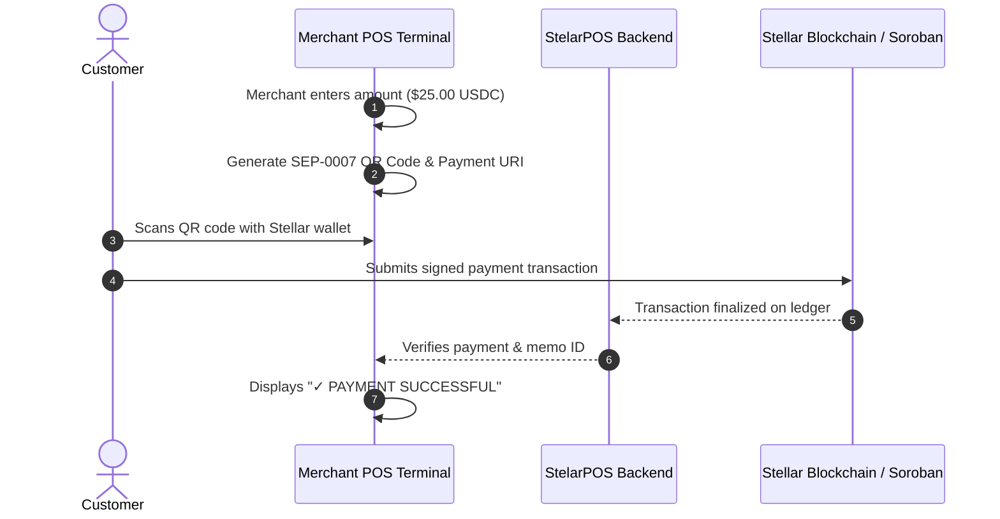

# StelarPOS 🌟

**Institutional-grade Point-of-Sale (POS) & Payment Infrastructure on the Stellar Blockchain**

[Explore Repositories](#-organization-repositories) • [Architecture](#-ecosystem-architecture) • [Roadmap](#-roadmap--milestones) • [Contributing](#-contributing)

---

## 🚀 About StelarPOS

Traditional merchant point-of-sale systems are hindered by high card processing fees (2.5% – 3.5% + fixed fees), multi-day settlement delays, chargebacks, and cross-border currency friction.

**StelarPOS** solves this by bridging real-world merchant terminals with the Stellar blockchain:
1. **Sub-Cent Fees**: Ultra-low network fees (~0.00001 XLM per transaction).
2. **Instant Finality**: 3–5 second finality directly into the merchant's Stellar vault.
3. **Price Stability**: Native USDC settlement with optional XLM payment support.
4. **Frictionless QR Payments**: Standard SEP-0007 QR code protocol compatible with all mobile Stellar wallets (Lobstr, Freighter, etc.).

---

## 🏛 Organization Repositories

| Repository | Description | Tech Stack | Status |
| :--- | :--- | :--- | :--- |
| 🖥️ **[POS-Frontend](https://github.com/StelarPOS/POS-Frontend)** | Merchant POS UI, Terminal Keypad, SEP-0007 QR Payment Modal, Dashboard & Ledger | React 18, Vite, Tailwind CSS, Lucide | 🚀 Active (~15% Scope) |
| ⚡ **[POS-Backend](https://github.com/StelarPOS/POS-Backend)** | Express API, Stellar Horizon SDK, PostgreSQL Prisma ORM, Transaction Verification | Node.js, Express, Prisma, Stellar SDK | ⚡ Active (~2% Scope) |
| 🦀 **[POS-Contract](https://github.com/StelarPOS/POS-Contract)** | Soroban Rust Smart Contract for persistent on-chain payment recording | Rust, Soroban SDK 22.0 | 🦀 Active (~3% Scope) |

---

## 🔄 Payment Lifecycle

---

## 📌 Roadmap & Milestones

- [x] **Milestone 1 (~20% Foundation)**:
  - [x] Responsive Merchant Dashboard & POS Terminal interface with digital keypad.
  - [x] Reusable Multi-State Payment Modal (Waiting, SEP-0007 QR, Success, Failed, Expired).
  - [x] Searchable Transaction History Ledger.
  - [x] Express.js API foundation (`GET /api/health`, `GET /api/payments/test`).
  - [x] PostgreSQL Prisma schema with `Payment` model.
  - [x] Soroban Rust smart contract (`record_payment`, `get_payment`) with passing unit tests.
- [ ] **Milestone 2 (~40%)**: Real-time Horizon payment stream listener & live PostgreSQL persistence.
- [ ] **Milestone 3 (~60%)**: Merchant authentication, multi-store accounts, API keys & webhooks.
- [ ] **Milestone 4 (~80%)**: Advanced analytics, automated refunds, and currency conversion.
- [ ] **Milestone 5 (~100%)**: Production Soroban settlement contract deployment, hardware POS integration & Mainnet launch.

---

## 🤝 Contributing & Community

We are building StelarPOS as a public open-source project. We welcome developers, blockchain enthusiasts, and designers to contribute!

* **Bug Reports & Features**: Open an issue in the respective repository ([Frontend](https://github.com/StelarPOS/POS-Frontend/issues), [Backend](https://github.com/StelarPOS/POS-Backend/issues), [Contract](https://github.com/StelarPOS/POS-Contract/issues)).
* **Pull Requests**: Review the `CONTRIBUTING.md` guidelines in each repository before submitting PRs.

---

## 📄 License

All repositories in the StelarPOS organization are licensed under the **[MIT License](LICENSE)**.
